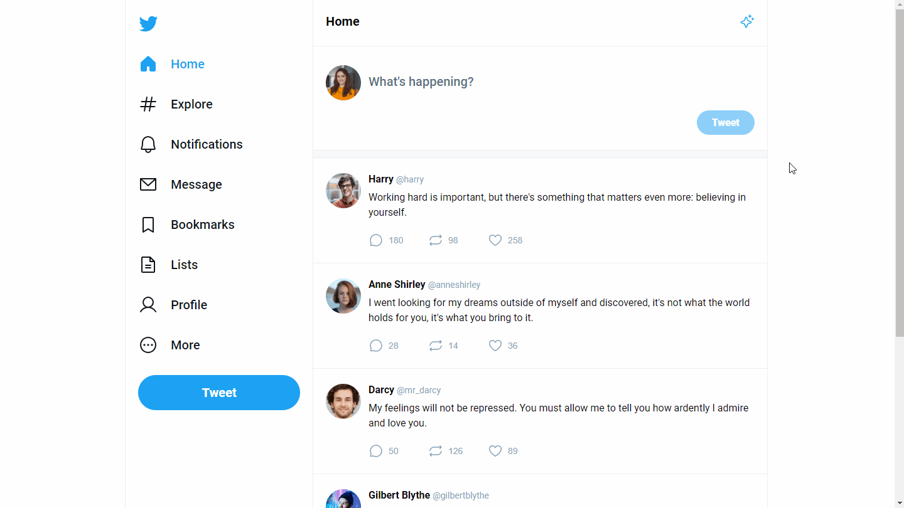
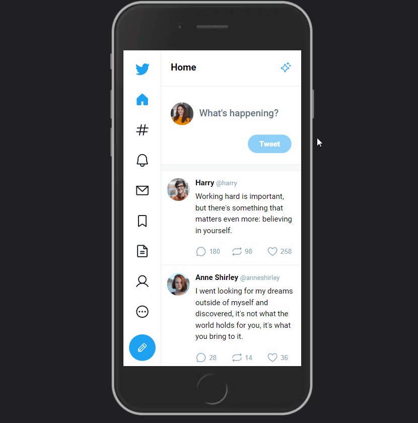

# Twitter UI 

This project is a clone of the Twitter User Interface, built with React and TypeScript.

The React Context API was used to share and manage state across the components without passing props down the tree. A global state was created and the child components were able to consume the data provided in the context such as the selected theme and the tweets' data.

The data used in the project, such as the users and the tweets, are fictional and were created to better exemplify the app's functionality.

## 🛠️ Technologies

- React
- TypeScript
- React Router
- Styled Components

## 🔗 Link

- [Live Site URL](https://twitter-ui-julianachagas.netlify.app/)

## 💻 Preview

- Web

 <br/><br/>

- Mobile

 <br/><br/>

## 💡 Features

✔️ Switch between light and dark themes. The selected theme is stored in the local storage and the app will load the preferred theme when the user revisits the page. \
✔️ Check the example tweets on the timeline \
✔️ Send a new tweet as the example user\
✔️ Click on one of the tweets, go to the individual page of the tweet, and check the replies to that tweet \
✔️ Send a new reply to any of the tweets on the timeline

## ⚙️ How to use

To clone and run this project you'll need [Node.js](https://nodejs.org/en/) and [Git](https://git-scm.com) installed on your computer. In addition, it is good to have an editor to work with the code like [VSCode] (https://code.visualstudio.com/). Follow the instructions bellow:

```bash
# Clone this repository
$ git clone https://github.com/julianachagas/twitter-ui.git

# Go into the repository
$ cd twitter-ui

# Install the dependencies
$ npm install

# Run the app in development mode
$ npm run dev

# Build the app for production to the 'dist' folder
$ npm run build

# Preview the production build locally
$ npm run preview
```

## 📚 Useful Resources

- [Layout by Rocketseat](https://www.figma.com/community/file/1202694130789327431/Twitter-UI)
- [Phosphor Icons](https://phosphoricons.com/)
- [@phosphor-icons/react](https://github.com/phosphor-icons/react)
- [Random Users](https://xsgames.co/randomusers/): Generates random user profile pictures
- [How to use React Context properly](https://medium.com/@tellisense/how-to-use-react-context-properly-with-3-easy-steps-f4aacdec3ab2) and [useContext() with Typescript](https://dev.to/madv/usecontext-with-typescript-23ln): great articles that helped me to understand how to implement React Context API with TypeScript to manage the global state
- [useMemo inside Context API - React](https://blog.agney.dev/useMemo-inside-context/): article on how to use useMemo with the Context API to prevent unnecessary renders in the child components.

## 👩🏻‍💻 Author

<a href="https://www.linkedin.com/in/juliana--chagas/" target="_blank"></a>
<a href="https://twitter.com/JulianaCoding" target="_blank"></a>

---

##### Made with 💜 by Juliana Chagas
